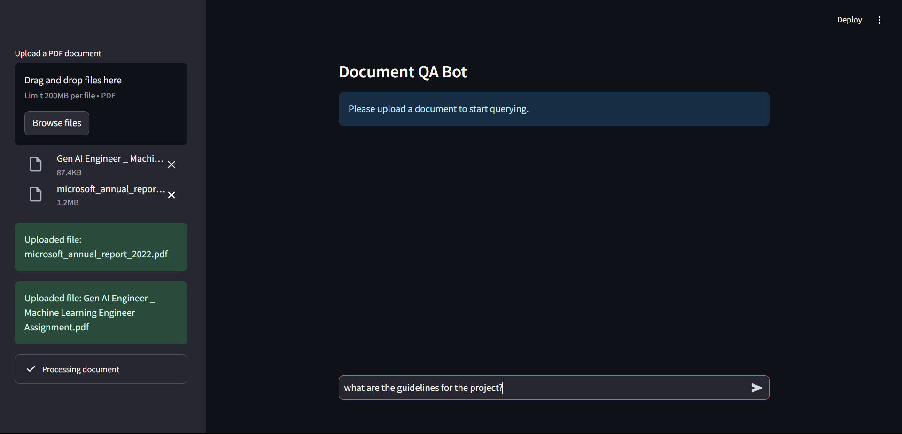
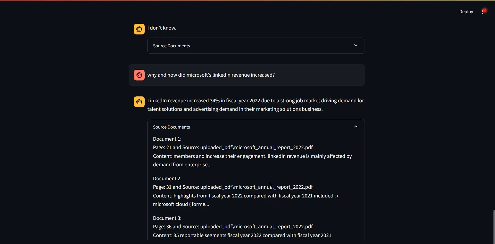
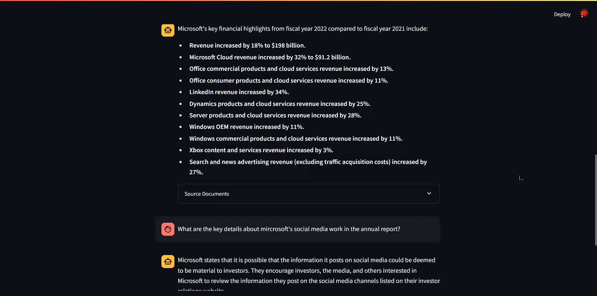

# Advance Retrieval-Augmented Generation (RAG) Application 🦜️🔗

This project is a **Retrieval-Augmented Generation (RAG)** application built with **LangChain** and integrates a **Chroma Vector Store** for efficient document retrieval and the **gemini-1.5-flash** model for generative question answering. **Streamlit** is used here for the UI.

The app allows users to upload documents (PDFs) and interact with a question-answering bot, which retrieves relevant sections from the uploaded documents and generates answers using LLM.

## UI





## Project Structure

```
advance-rag-application/
│
├── app.py                    # Streamlit UI entry point
├── backend/                  
│   ├── __init__.py            # Initialize the backend module
│   ├── document_processing.py # PDF extraction, text splitting into chunks, embeddings and vector store
│   ├── query_handling.py      # Query expansion, document retrieval, reranking, and response generation
│   └── model_integration.py   # Gemini Model integration
│
├── requirements.txt           # Python dependencies for your project
├── Dockerfile                 # Docker setup for containerizing the application
└── .dockerignore              # Files to ignore when building Docker image
```

## Features

- **Document Upload**: Upload PDFs to extract text.
- **Document Processing**: Efficiently splits documents into tokens and stores them using Chroma DB.
- **RAG-based QA Bot**: Queries are answered based on retrieved document sections using the Chroma vector database.
- **Query Expansion & Reranking**: Expands user queries and applies cross-encoder reranking to the retrieved documents for better context and more relevant results.
- **Chains**: The RAG pipeline is built using **Chains** from LangChain providing seamless querying and retrieval.

## Prerequisites

- Python 3.9+
- Docker (if you want to run the app in a container)
- A valid API key for the Gemini model (e.g., `GOOGLE_API_KEY`)
- 🤗 Access Token for Embedding Model (i.e., `HF_TOKEN`)

## Setup

### 1. Clone the Repository

```bash
git clone https://github.com/shivam110601/advance-rag-application.git
cd advance-rag-application
```

### 2. Create a Virtual Environment

```bash
python3 -m venv venv
source venv/bin/activate  # Linux/macOS
# or
venv\Scripts\activate     # Windows
```

### 3. Install Dependencies

Make sure your `requirements.txt` contains all required libraries:

```bash
pip install -r requirements.txt
```

### 4. Set API Keys

You need to configure the following environment variables for the application to work:

- `GOOGLE_API_KEY`: The API key for the Gemini generative model.
- `HF_TOKEN`: The Access Token for Hugging Face

You can set these in your terminal or within your Python code before running the app.

```bash
export GOOGLE_API_KEY="your-google-api-key"
```

### 5. Run the Application

After setting up your environment, run the Streamlit application:

```bash
streamlit run app.py
```

Visit `http://localhost:8501` in your browser to interact with the app.

## Docker Setup

If you prefer running the app inside a Docker container, follow these steps:

### 1. Build the Docker Image

```bash
docker build -t advance-rag-app .
```

### 2. Run the Docker Container

```bash
docker run -p 8501:8501 advance-rag-app
```

Now visit `http://localhost:8501` in your browser.

### 3. Customize Docker Environment Variables

To use environment variables such as API keys inside Docker, you can pass them when running the container:

```bash
docker run -e GOOGLE_API_KEY="your-google-api-key" -p 8501:8501 advance-rag-app
```

## Usage

1. Upload a PDF document via the Streamlit interface.
2. The document will be processed and split into retrievable chunks.
3. Bigger the document more time it will take for document processing, so wait for it accordingly.
4. Use the chat interface to ask questions about the document.
5. The app will show the LLM response along with information about retrieved documents in an expandable.


## License

This project is licensed under the MIT License.
